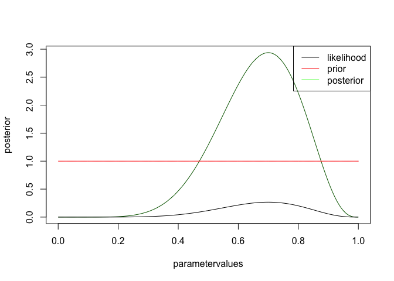
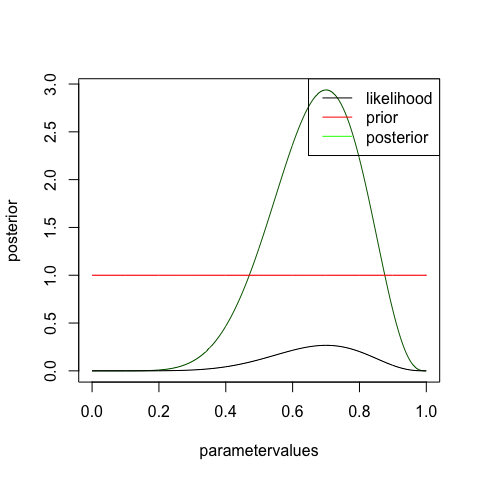
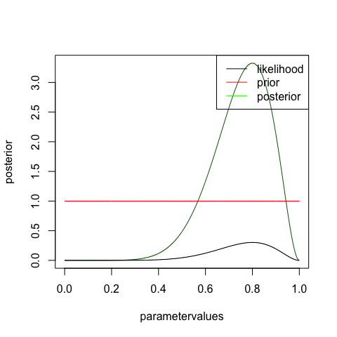

Statistical concepts, at the example of the coin flip model
===

Assume we had 10 trials, 7 success, unknown coin, want to do inference to learn about the coin


```r
rm(list=ls(all=TRUE))
set.seed(123)
trials = 10
success = 7
```

In the rest of this script, I will look at this data with the three most common inferential methods 

1. Maximum likelihood estimation
2. Null-hypothesis significance testing
3. Bayesian inference 

Each of these methods is consistent and calculates a sensible thing. But each of these three things are different. I'll highlight differences at the end of each application. 

# THE MLE ESTIMATE

The idea of maximum likelihood estimation (MLE) is to look for the set of parameters that would, under the given model assumption, lead to the highest probability to obtain the observed data. In our case we have only one parameter, the probability of success per flip. Let's plot this for different values and look for the maximum.  


```r
# parameters to check
parametervalues <- seq(0,1,0.001)
# get the probability for all parametervalues
likelihood <- dbinom(success,trials,parametervalues)

# plot results
plot(parametervalues, likelihood, type = "l")
legend("topleft", legend = c("Likelihood", "maximum"), col = c("black", "red"), lwd = 1)
MLEEstimate <- parametervalues[which.max(likelihood)]
abline(v=MLEEstimate, col = "red")
```

 

## Confidence intervals

OK, the MLE is the best value, but what is often m

MLE confidence intervals are constructed by comparing likelihood values of single parameters against each other. We have the MLE estimate as null hypothesis and ask ourselves how likely it is that the true parameter is a different one. By cutting at 0.05 probability, we construct the frequentist CI interval. The test statistics that can be used to do this are discussed, e.g., in https://onlinecourses.science.psu.edu/stat504/node/39. The result for a 1-parameter model is that the CI is at a log likelihood difference of 1.96


```r
plot(parametervalues, likelihood, type = "l")
legend("topleft", legend = c("Likelihood", "maximum", "CI"), col = c("black", "red", "green"), lwd = 1)
MLEEstimate <- parametervalues[which.max(likelihood)]
abline(v=MLEEstimate, col = "red")

confidence.level <- log(max(likelihood)) -1.96
leftCI <- parametervalues[which.min(abs(log(likelihood[1:which.max(likelihood)]) - confidence.level))]
abline(v=leftCI, col = "green")
rightCI <- parametervalues[which.min(abs(log(likelihood[which.max(likelihood):length(likelihood)]) - confidence.level)) + which.max(likelihood) -1]
abline(v=rightCI, col = "green")
```

 

## Outcome of a MLE 

* Best estimate (MLE)
* 95% CI --> if we would do the experiment over and over again, 95% of the CIs would contain the true value. NOTE: this is != saying: for a given dataset, the true value is in the CI with 95% probability!


# GETTING THE P-VALUE FOR FAIR COIN

want to get p-value for a smaller or equal result (1-tailed) given a fair coin p(k<=kobs|H0:p=0.5). Basically, we want the sum over the red bars


```r
barplot(dbinom(0:10, 10, 0.5), col = c(rep("grey", success ), rep("red", 11-success)))
```

 

```r
line(pbinom(0:10,trials,prob = 0.5, lower.tail = F))
```

```
## 
## Call:
## line(pbinom(0:10, trials, prob = 0.5, lower.tail = F))
## 
## Coefficients:
## [1]   1.2640  -0.1373
```


We can get this with the cummulative distribution function in R


```r
pValue <- pbinom(success-1,trials,prob = 0.5, lower.tail = F)
pValue
```

```
## [1] 0.171875
```

```r
pValue < 0.05
```

```
## [1] FALSE
```

but it is a bit tricky, because depeding on which side one wants to test, you have to add a -1 (because of the definition of the cummulative). So, it's instructive to do it that way, but easier in practice to use the binom.test, which calculates the same values 


```r
binom.test(7,trials,0.5) # two sided 
```

```
## 
## 	Exact binomial test
## 
## data:  7 and trials
## number of successes = 7, number of trials = 10, p-value = 0.3438
## alternative hypothesis: true probability of success is not equal to 0.5
## 95 percent confidence interval:
##  0.3475471 0.9332605
## sample estimates:
## probability of success 
##                    0.7
```

```r
binom.test(7,trials,0.5, alternative="greater") # testing for greater
```

```
## 
## 	Exact binomial test
## 
## data:  7 and trials
## number of successes = 7, number of trials = 10, p-value = 0.1719
## alternative hypothesis: true probability of success is greater than 0.5
## 95 percent confidence interval:
##  0.3933758 1.0000000
## sample estimates:
## probability of success 
##                    0.7
```

```r
binom.test(7,trials,0.5, alternative="less") # testing for less
```

```
## 
## 	Exact binomial test
## 
## data:  7 and trials
## number of successes = 7, number of trials = 10, p-value = 0.9453
## alternative hypothesis: true probability of success is less than 0.5
## 95 percent confidence interval:
##  0.0000000 0.9127356
## sample estimates:
## probability of success 
##                    0.7
```

## Outcome of a MLE 

* p-value --> probability to see the observed or more extreme data given the null hypothesis
* rejection H0 if p < alpha. If p > alpha, the test ist inconclusive


## Multiple testing

Imagine we do 20 times a test, but we have no effect.


```r
data= rbinom(20,10,0.5)
pValue <- pbinom(data,trials,prob = 0.5, lower.tail = F)
pValue
```

```
##  [1] 0.62304687 0.17187500 0.37695313 0.05468750 0.05468750 0.94531250
##  [7] 0.37695313 0.05468750 0.37695313 0.37695313 0.01074219 0.37695313
## [13] 0.17187500 0.37695313 0.82812500 0.05468750 0.62304687 0.94531250
## [19] 0.62304687 0.01074219
```

```r
max(pValue < 0.05) == 1
```

```
## [1] TRUE
```

```r
pValueAdjusted <- p.adjust(pValue, method = "hochberg")
pValueAdjusted
```

```
##  [1] 0.9453125 0.9453125 0.9453125 0.8203125 0.8203125 0.9453125 0.9453125
##  [8] 0.8203125 0.9453125 0.9453125 0.2041016 0.9453125 0.9453125 0.9453125
## [15] 0.9453125 0.8203125 0.9453125 0.9453125 0.9453125 0.2041016
```

```r
max(pValueAdjusted < 0.05) == 1
```

```
## [1] FALSE
```


## Long-term frequencies of errors and multiple testing

imagine we have a fair coin, and do 1000 experiments with 10 draws, looking at the p-value, note that we get to the right 5% assumptotically, but not for small data. The fact that it is not exactly 5% is an artifact that appears for discrete distributions (<8 gets acceted, >= 8 rejected, the perfect cut would be intbetween but as we have only discrete options that's not possible to choose)


```r
par(mfrow=c(2,1))
trials = 10
outcome <- rbinom(1000, trials, 0.5)
hist(pbinom(outcome,trials,0.5), breaks = 100, main = "10 trials, 11 p-values" )
sum(pbinom(outcome,trials,0.5) < 0.05)
```

```
## [1] 13
```

```r
trials = 10000
outcome <- rbinom(1000, trials, 0.5)
hist(pbinom(outcome,trials,0.5), breaks = 100, main = "10000 trials, p-values flat"  )
```

 

```r
sum(pbinom(outcome,trials,0.5) < 0.05)
```

```
## [1] 46
```

remember: in general, if you choose an alpha level of 5%, and you have absolutely random data, you should get 5% false positives (type I error) assymptotically, and the distribution of p-values in repeated experiments will be flat. 

Also note: we are free to choose the null-hypothesis as we want. What would you do if you null hypothesis is that a coint should have an 0.8 proability of head?

# The BAYESIAN ESTIMATE

Remember for Bayes p(M|D) = p(D|M) * p(M) / P(D), and we can show that p(D) is just the integral over p(D|M) * p(M)

We had already calculated p(D|M), so we just need to define p(M), the prior

for flat prior p(M) = flat = 1
See http://en.wikipedia.org/wiki/Jeffreys_prior , section on Bernoulli trial, to understand that this is not neccesarily the best uninforative choice, but it is simple at any rate


```r
prior <- rep(1,1001)
posterior <- likelihood * prior / sum(likelihood * prior) * length(parametervalues)

plot(parametervalues, posterior, col = "darkgreen", type = "l")
lines(parametervalues, likelihood)
lines(parametervalues, prior, col = "red" )
legend("topright", c("likelihood", "prior", "posterior"), col = c("black", "red", "green"), lwd = 1 )
```

 

you see that likelihood and posterior have the same shape. However, this is only because I chose a flat prior. There is still a difference, however, namely that the posterior is normalized, i.e. will integrate to one. It has to be, because we want to interpret it as a pdf, while the likelihood is not a pdf. Let's look at the same example for an informative prior


```r
prior <- dnorm(parametervalues, mean = 0.5, sd = 0.1)
posterior <- likelihood * prior / sum(likelihood * prior) * length(parametervalues)

plot(parametervalues, posterior, col = "darkgreen", type = "l")
lines(parametervalues, likelihood)
lines(parametervalues, prior, col = "red" )
legend("topright", c("likelihood", "prior", "posterior"), col = c("black", "red", "green"), lwd = 1 )
```

 

you can see that the likelihood moves the posterior away from the prior, but not by much. try the same think with more data, but the same ratio, i.e. change to 30 trials, 9 success


# Bayesian CI

calculated via central 95% probability


```r
plot(parametervalues, posterior, col = "darkgreen", type = "l")
lines(parametervalues, likelihood)
lines(parametervalues, prior, col = "red" )
legend("topright", c("likelihood", "prior", "posterior"), col = c("black", "red", "green"), lwd = 1 )

cumPost <- cumsum(posterior) / (length(posterior) -1)

leftCI <- parametervalues[which.min(abs(cumPost - 0.025))]
abline(v=leftCI, col = "darkgreen", lty = 2, lwd = 2)
leftCI <- parametervalues[which.min(abs(cumPost - 0.975))]
abline(v=leftCI, col = "darkgreen", lty = 2, lwd = 2)
```

 


