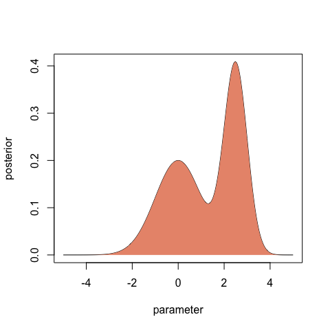
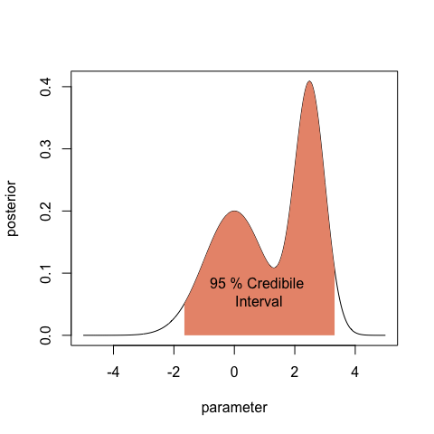
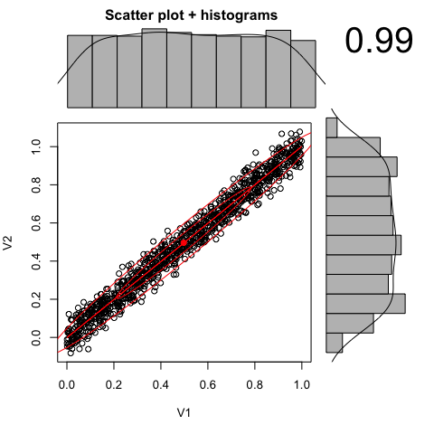

# Interpreting Bayesian Posteriors
FlorianHartig  
9 May 2015  


```
## Warning: package 'coda' was built under R version 3.1.3
```

```
## Loading required package: grid
## Loading required package: lattice
```

In standard statistics, we are used to interpret search for the point that maximizes p(D|phi), and interpret this as the most likely value. 


```r
parameter = seq(-5,5,len=500)
likelihood = dnorm(parameter) + dnorm(parameter, mean = 2.5, sd=0.5)

plot(parameter,likelihood, type = "l")

MLEEstimate <- parameter[which.max(likelihood)]
abline(v=MLEEstimate, col = "red")
text(2.5,0.8, "MLE", col = "red")
```

 

Assume the prior is flat, then we get the posterior simply by normalization


```r
unnormalizedPosterior = likelihood * 1 
posterior = unnormalizedPosterior / sum(unnormalizedPosterior/50) 
```

In Bayesian statistics, the primary outcome of the inference is the whole distribution. 


```r
plot(parameter,posterior, type = "l")
polygon(parameter, posterior, border=NA, col="darksalmon")
```

 

If we don't have to, this is what we should interpret and forecast with. However, in many cases, people what to summarize this distribution by particular values. Here is what you typically use for different situations

### The best values 

The problem with the best values is that it depends what you want to do with it. If you want to have the most likely parameter value, what you can do is to use the mode of the posterior distribution. It is called the maximum a posteriori probability (MAP) estimate. 

However, if the distribution is very skewed as in our example, it may well be that the MAP is far at one side of the distribution, and doesn't really give a good distribution of where most probability mass is. If it is really neccessary to do predictions with one value (instead of forwarding the whole posterior distribution), I would typically predict with the median of the posterior. 


```r
plot(parameter,posterior, type = "l")
polygon(parameter, posterior, border=NA, col="darksalmon")


MAP <- parameter[which.max(posterior)]
abline(v=MAP, col = "red")
text(2.5,0.4, "MAP", col = "red")


medianPosterior <- parameter[min(which(cumsum(posterior) > 0.5 * 50))]
abline(v=medianPosterior, col = "blue")
text(1.8,0.3, "Median", col = "blue")
```

 

### Bayesian credibile intervals

Typically, one also wants uncertainties. There basic option to do this is the Bayesian credible interval, which is the analogue to the frequentist confidence interval. The 95 % Bayesian Credibility interval is the centra 95% of the posterior distribution


```r
plot(parameter,posterior, type = "l")


lowerCI <- min(which(cumsum(posterior) > 0.025 * 50))
upperCI <- min(which(cumsum(posterior) > 0.975 * 50))

par = parameter[c(lowerCI, lowerCI:upperCI, upperCI)]
post = c(0, posterior[lowerCI:upperCI], 0)

polygon(par, post, border=NA, col="darksalmon")

text(0.75,0.07, "95 % Credibile\n Interval")
```

 

There are two alternatives to the credibility interval that is particularly useful if the posterior has weird correlation structres.

1. The **Highest Posterior Density** (HPD). The HPD is the x% highest posterior density interval is the shortest interval in parameter space that contains x% of the posterior probability. It would be a bit cumbersome to calculate this in this example, but if you have an MCMC sample, you get the HPD with the package coda via


```r
HPDinterval(obj, prob = 0.95, ...)
```

2. The Lowest Posterior Loss (LPL) interval, which considers also the prior. 

More on both alternatives [here](http://www.bayesian-inference.com/credible)


### Multivariate issues

Things are always getting more difficult if you move to more dimensions, and Bayesian analysis is no exception. 

#### Marginal values hide correlations 

This get a bit more complicated if we move to multivariate parameter spaces (the normal situation). 

I problem that often occurs here is that there are correlations between parameters. In this case, the marginal posterior distributions that are reported in the summary() or plot functions of coda can be VERY misleading. 

Look at the situation below, where we have two parameters that are highly correlated. The marginal posteriors look basically flat, and looking only at them you may think there is no information in the likelihood. 

However, if you look at the correlation, you see that the likelihood has excluded vast areas of the prior space (assuming we have had flat uncorrelated likelihoods in this case). 


```r
library(psych)
```

```
## Warning: package 'psych' was built under R version 3.1.3
```

```r
par1= runif(1000,0,1)
par2 =par1 + rnorm(1000,sd = 0.05)
scatter.hist(par1,par2)
```

 

It is therefore vital to plot the correlation plots as well to be able to judge the extent to which parameters are uncertaint. 

If you have more parameters, however, you may still miss things here, because there could be higher-order correlations between the parameters that look random in the two-dimensional plot. A good proxy to get an overall reduction of uncertainy across all parameters, including all these higher-order correlations, is to compare the prior predictive distribution with the posterior predictive distribution. 


#### Nonlinear correlations

A further issue that many people are not aware of is that the marginal mode (maximum) does not need to coincide with the global mode if correlations in parameter space are nonlinear. Assume we have a posterior with 2 parameters, which are in a complcated, banana-shaped correlation. Assume we are able to sample from this poterior. Here is an example from Meng and Barnard, code from the bayesm package (see Rmd source file for code of this function).


If we plot the correlation, as well as the marginal distributions (i.e. the histograms for each parameter), you see that the mode of the marginal distributions will not conincide with the multivariate mode (red, solid lines).


```r
set.seed(124)
sample=banana(A=0.5,B=0,C1=3,C2=3,50000)
scatterhist(sample[,1], sample[,2])
```

 

```r
#par(mfg = c(2,1))

# skaliert nicht richtig!!!, vielleicht in die Histogramme einbauen?

#abline(h = 0.22, col = "green", lwd = 3, lty =2)
#abline(v = 0.295, col = "green", lwd = 3, lty =2)
```

Hence, it's important to note that the marginal distributions are not suited to calculate the MAP, CIs, HPDs or any other summary statistics if the posterior distribution is not symmetric in multivariate space. This is a real point of confusion for many people, so keep it in mind!

More options to plot HPD in 2-d here http://www.sumsar.net/blog/2014/11/how-to-summarize-a-2d-posterior-using-a-highest-density-ellipse/


### FAQs

* http://stats.stackexchange.com/questions/176436/what-would-be-the-reason-that-the-posterior-distribution-looks-like-the-prior-us


---
**Copyright, reuse and updates**: By Florian Hartig. Updates will be posted at https://github.com/florianhartig/LearningBayes. Reuse permitted under Creative Commons Attribution-NonCommercial-ShareAlike 4.0 International License

