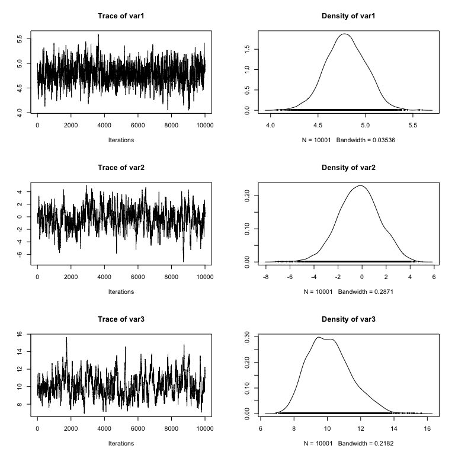
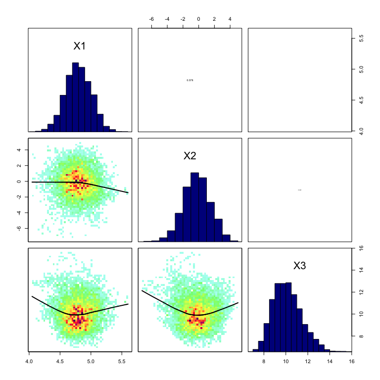
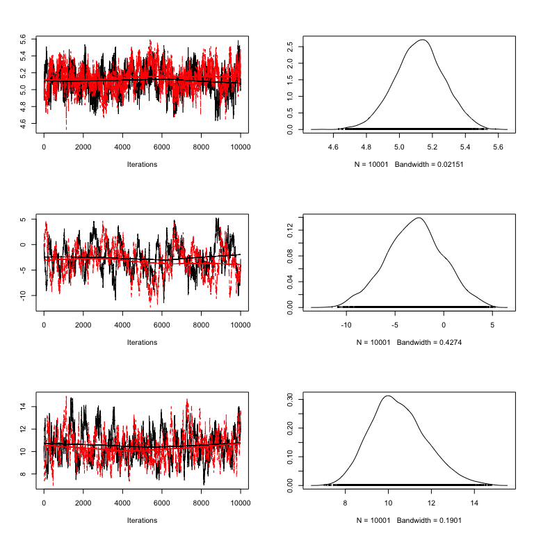

MCMC chain analysis and convergence diagnostics with coda in R
====


## Create test data and define the model
As a first step, we create some test data n which a dependent variable y depends linearly on an independent variable x (predictor). 


```r
# Load coda library
library(coda)

# Define variables
trueA <- 5
trueB <- 0
trueSd <- 10
sampleSize <- 31

# Create independent x-values
x <- (-(sampleSize-1)/2):((sampleSize-1)/2)

# Create dependent values according to ax + b + N(0,sd)
y <-  trueA * x + trueB + rnorm(n=sampleSize,mean=0,sd=trueSd)

 
# Plot data
plot(x,y, main="Test Data")
```

 

```r
# Likelihood function
likelihood <- function(param){
  a = param[1]
  b = param[2]
  sd = param[3]
   
  pred = a*x + b
  singlelikelihoods = dnorm(y, mean = pred, sd = sd, log = T)
  sumll = sum(singlelikelihoods)
  return(sumll)    
}

# Prior distribution
prior <- function(param){
  a = param[1]
  b = param[2]
  sd = param[3]
  aprior = dunif(a, min=0, max=10, log = T)
  bprior = dnorm(b, sd = 5, log = T)
  sdprior = dunif(sd, min=0, max=30, log = T)
  return(aprior+bprior+sdprior)
}

# Proposal function
proposalfunction <- function(param){
  return(rnorm(3,mean = param, sd= c(0.1,0.5,0.3)))
}

# Metropolis algorithm 
run_metropolis_MCMC <- function(startvalue, iterations){
  chain = array(dim = c(iterations+1,3))
  chain[1,] = startvalue
  for (i in 1:iterations){
    proposal = proposalfunction(chain[i,])
     
    probab = exp(likelihood(proposal)+ prior(proposal) - likelihood(chain[i,])- prior(chain[i,]))
    if (runif(1) < probab){
      chain[i+1,] = proposal
    }else{
      chain[i+1,] = chain[i,]
    }
  }
  return(mcmc(chain))
}
```

<br />


So, let’s run the MCMC:


```r
startvalue = c(4,2,8)
chain = run_metropolis_MCMC(startvalue, 10000)
```


<br />

#### Some simple summaries of the chain facilitated by coda


The $run_metropolis_MCMC()$ function returns the posterior sample as a coda object of class “mcmc” (this is done in the line “$return(mcmc(chain))$”).

What’s the sense of this line? Well, coda is an R package that provides a number of standard functions for plotting and analysis of the posterior samples. For those functions to work, you need to have your output as an object of class “mcmc”, or “mcmc.list”, which we will discuss later. Coda is the standard package for this type of analysis, and most Bayesian packages in R use this class to return MCMC outputs, so you will likely come across this syntax whatever Bayesian code you are running.

Objects of class “mcmc” hold and array with the mcmc samples, and a number of additional information. You can look at the structure with str(chain), and you can transform a “mcmc” object back to a normal data-frame by data.frame(chain).

The advantage of having a coda object is that a lot of things that we typically want to do with the chain are already implemented, so for example we can simply summary() and plot() the outputs which gives some useful information on the console and a plot that should look roughly like this:


```r
# Run summary and plot results
summary(chain)
```

```
## 
## Iterations = 1:10001
## Thinning interval = 1 
## Number of chains = 1 
## Sample size per chain = 10001 
## 
## 1. Empirical mean and standard deviation for each variable,
##    plus standard error of the mean:
## 
##         Mean     SD Naive SE Time-series SE
## [1,]  4.7969 0.2182 0.002182        0.01162
## [2,] -0.2613 1.7177 0.017176        0.13905
## [3,] 10.1687 1.3333 0.013333        0.13717
## 
## 2. Quantiles for each variable:
## 
##        2.5%    25%     50%     75%  97.5%
## var1  4.359  4.650  4.7948  4.9466  5.220
## var2 -3.617 -1.406 -0.2904  0.9071  3.018
## var3  7.974  9.205 10.0277 10.9557 13.194
```

```r
plot(chain)
```

 

<br />

I think the summary is self-explanatory (otherwise check out the help), but maybe a few words on the results of the plot() function: each row corresponds to one parameter, so there a are two plots for each parameter. The left plot is called a trace plot – it shows the values the parameter took during the runtime of the chain. The right plot is usually called a marginal density plot. Basically, it is the (smoothened) histogram of the values in the trace-plot, i.e. the distribution of the values of the parameter in the chain.

<br />

## Marginal densities hide correlations

Marginal densities are an average over the values a parameter takes with all other parameters “marginalized”, i.e. other parameters having any values according to their posterior probabilities. Often, marginal densities are treated as the main output of a Bayesian analysis (e.g. by reporting their mean and sd of), but I strongly advice against this practice without further analysis. The reason is that marginal densities “hide” correlations between parameters, and if there are correlations, parameter uncertainties appear to be much greater in the marginals that they actually are. To check for pairwise correlations is quite easy – just use pairs on the MCMC chain:

We could use pairs(data.frame(chain)), but I will create a bit nicer plot function


```r
library(IDPmisc)
```

```
## Loading required package: grid
## Loading required package: lattice
```

```r
panel.hist <- function(x, ...)
{
  usr <- par("usr"); on.exit(par(usr))
  par(usr = c(usr[1:2], 0, 1.5) )
  h <- hist(x, plot = FALSE)
  breaks <- h$breaks; nB <- length(breaks)
  y <- h$counts; y <- y/max(y)
  rect(breaks[-nB], 0, breaks[-1], y, col="blue4", ...)
}
 
panel.cor <- function(x, y, digits=2, prefix="", cex.cor)
{
  usr <- par("usr"); on.exit(par(usr))
  par(usr = c(0, 1, 0, 1))
  r <- abs(cor(x, y, method = "spearman"))
  txt <- format(c(r, 0.123456789), digits=digits)[1]
  txt <- paste(prefix, txt, sep="")
  if(missing(cex.cor)) cex <- 0.8/strwidth(txt)
  text(0.5, 0.5, txt, cex = cex * r)
}
 
betterPairs <- function(YourData){
  return(pairs(YourData, lower.panel=function(...) {par(new=TRUE);ipanel.smooth(...)}, diag.panel=panel.hist, upper.panel=panel.cor))
}
 
# Example
#x = rnorm(10000)
#betterPairs(data.frame(A = x, B = 0.6 * x + 0.3 * rnorm(10000), C = rnorm(10000)))
```


```r
betterPairs(data.frame(chain))
```

 

In our case, there is be no large correlations because I set up the example in that way, but we can easily achieve a correlation between slope and intercept by “uncentering” our data, that is, having x-values that are not centered around 0. To see this, replace in the first large code fragment the creation of the test data by this line which creates non-centered x-values, and run everything again 


```r
x <- (-(sampleSize-1)/2):((sampleSize-1)/2) + 20
startvalue = c(4,2,8)
chain = run_metropolis_MCMC(startvalue, 10000)
betterPairs(data.frame(chain))
```

 

You can see the strong correlation between the first and the second parameter (slope and intercept), and you can also see that your marginal uncertainty for each parameter (on the diagonal, or in your plot() function) has increased. However, it is really important to understand that this does not mean that the fit is fundamentally more uncertain – the Bayesian analysis doesn’t care if you shift the x-values by 20 to the right. Unlike some other statistical techniques, the method has no problems with such correlations. However, it is problematic now to summarize the results of such an analysis e.g. in terms of marginal values, because this is hiding the correlations. For example, it doesn’t make sense any more to say that the slope has a value of x +/- sd because this misses that point that for any given parameter of the intercept, the uncertainty of the slope is much smaller. For that reason, one should always check the correlations, and if possible, one should try to avoid correlations between parameters because this makes the analysis easier.

Note that we only checked for pairwise correlations here, there may still be higher order interactions that don’t show up in an analysis like that, so you may still be missing something. For that reason, the advice is to summarize the chain only when really necessary, otherwise things like the prior predictive distribution etc. should always be created by sampling directly from the chain.

## Convergence diagnostics

Now, to the convergence: an MCMC creates a sample from the posterior distribution, and we usually want to know whether this sample is sufficiently close to the posterior to be used for analysis. There are several standard ways to check this, but I recommend the Gelman-Rubin diagnostic (check the coda help for other options that are implemented). Basically, Gelman-Rubin measures whether there is a significant difference between the variance within several chains and the variance between several chains by a value that is called “scale reduction factors”. To do this, we obviously need a second chain, and then simply run the commands:


```r
chain2 = run_metropolis_MCMC(startvalue, 10000)
combinedchains = mcmc.list(chain, chain2) 
plot(combinedchains)
```

 

```r
gelman.diag(combinedchains)
```

```
## Potential scale reduction factors:
## 
##      Point est. Upper C.I.
## [1,]       1.02       1.03
## [2,]       1.09       1.26
## [3,]       1.01       1.04
## 
## Multivariate psrf
## 
## 1.04
```

```r
gelman.plot(combinedchains)
```

 

The gelman.diag gives you the scale reduction factors for each parameter. A factor of 1 means that between variance and within chain variance are equal, larger values mean that there is still a notable difference between chains. Often, it is said that everything below 1.1 or so is OK, but note that this is more a rule of thumb. The gelman,plot shows you the development of the scale-reduction over time (chain steps), which is useful to see whether a low chain reduction is also stable (sometimes, the factors go down and then up again, as you will see). Also, note that for any real analysis, you have to make sure to discard any bias that arises from the starting point of your chain (burn-in), typical values here are a few 1000-10000 steps. The gelman plot is also a nice tool to see roughly where this point is, that is, from which point on the chains seem roughly converged.

## Improving convergence / mixing

So, what to do if there is no convergence yet? Of course, you can always run the MCMC longer, but the other option is to make it converge faster … the word that is used here is “mixing”, which basically means how well the algorithm jumps around in the parameter space … the mixing is affected by the choice of your proposal function. Two things can happen:

* Your proposal function is narrow compared to the distribution we sample from – high acceptance rate, but we don’t get anywhere, bad mixing
* Your proposal function is too wide compared to the distribution we sample from – low acceptance rate, most of the time we stay where we are


As displayed in the figure, these problems can be seen in the trace plots. Theoretical considerations show that an acceptance rate of 20-30% is optimal for typical target distributions, but this is in practice not so helpful because you can still have very bad mixing although being at this level by having the proposal of one parameter too narrow and the proposal of another parameter too wide. Better to look at the trace-plots of the individual parameters. Again, correlations are a problem, so if you have strong correlations in parameter space, you can get bad mixing. Using multivariate proposals that are adjusted to the correlation structure can help, but in general it is better to avoid correlations if possible. The good news at last: most of the more “professional” MCMC sampling software such as Jags or WinBugs will do these things automatically for you.

