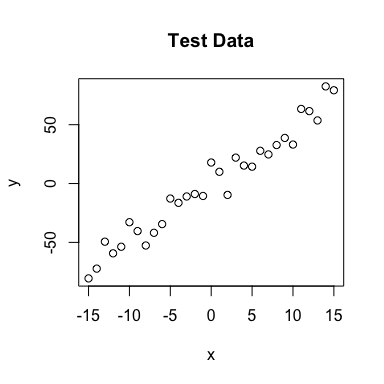
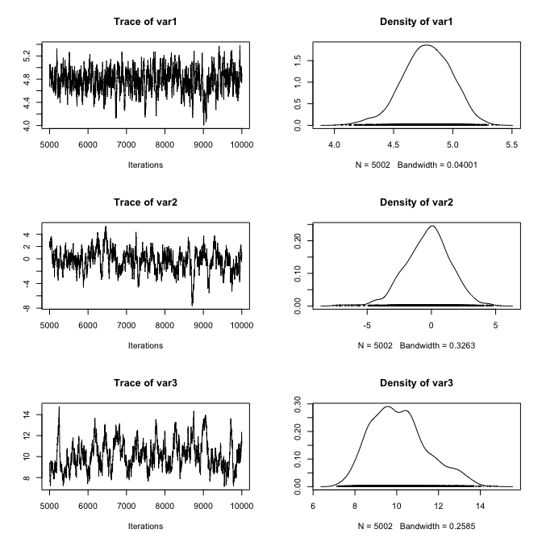
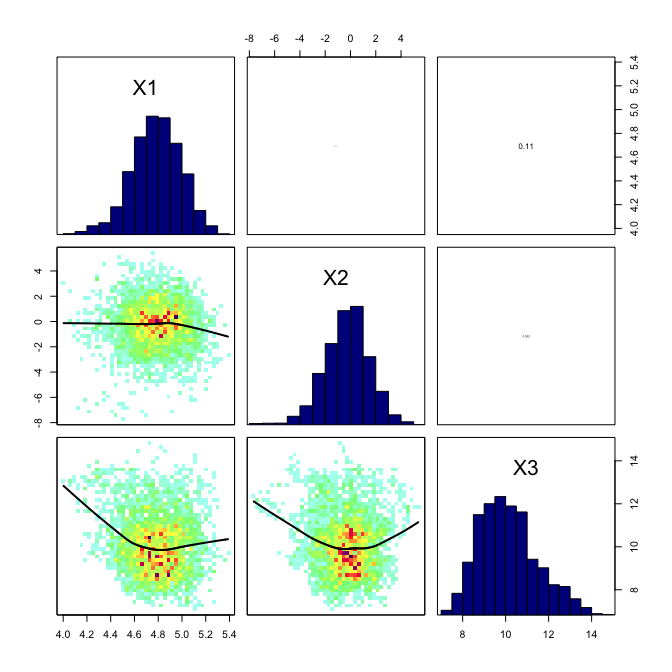
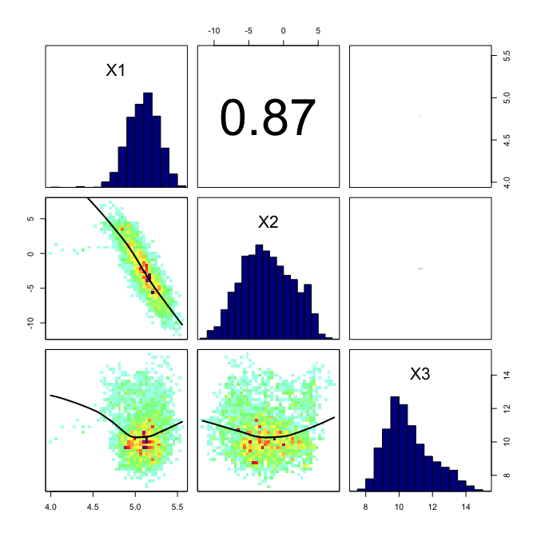
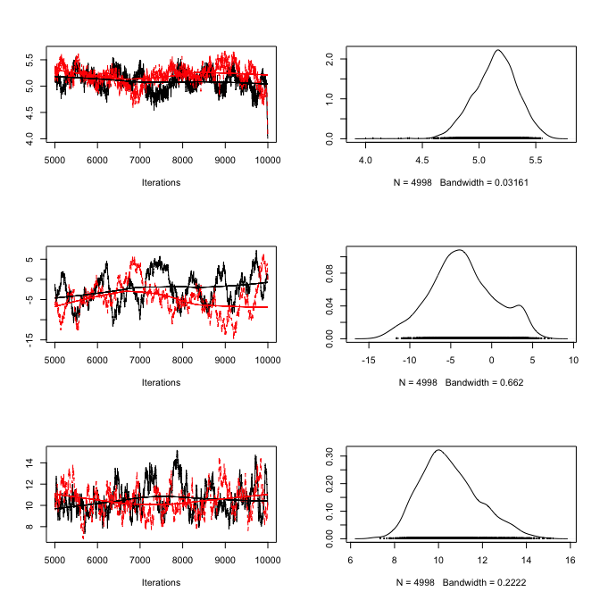
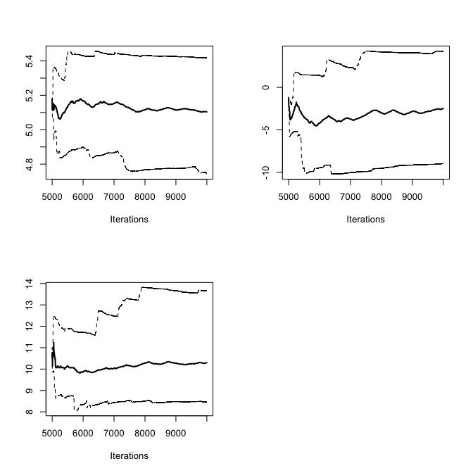
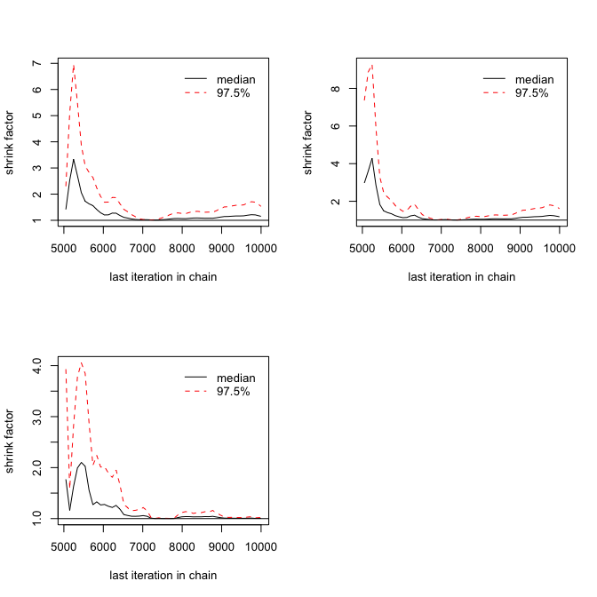
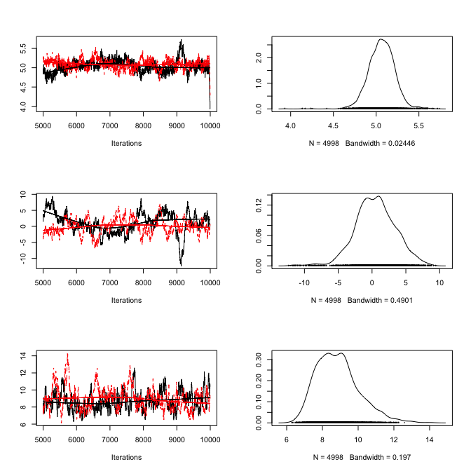
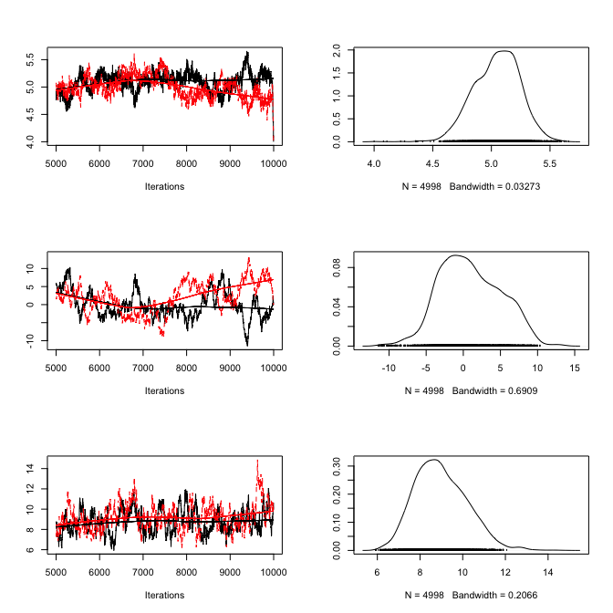

A simple Metropolis-Hastings MCMC in R  
====


*Summary*: the idea of this tutorial is to understand how MCMCs are used to sample the posterior distribution in a Bayesian analysis. We will

* Set up the posterior function for a linear regression 
* Use a simple hand-programmed MCMC to sample from the posterior
* Discuss the basics of tuning, convergence checks and interpretation of the posterior sample.

## Creating some test data

As a first step, we create some test data that will be used to fit our model. Let’s assume a linear relationship between the predictor and the response variable, so we take a linear model and add some noise.


```r
trueA <- 5
trueB <- 0
trueSd <- 10
sampleSize <- 31
 
# Create independent x-values
x <- (-(sampleSize-1)/2):((sampleSize-1)/2)
# Create dependent values according to ax + b + N(0,sd)
y <-  trueA * x + trueB + rnorm(n=sampleSize,mean=0,sd=trueSd)

# Plot data
plot(x,y, main="Test Data")
```

<!-- -->

<br />

## Defining the statistical model and the likelihood function 

The next step is to specify the statistical model. We already know that the data was created with a linear relationship y = a*x + b between x and y and a normal error model N(0,sd) with standard deviation sd, so let’s use the same model for the fit and see if we can retrieve our original parameter values. 

For estimating parameters in a Bayesian analysis, we need to derive the likelihood function for the model that we want to fit. The likelihood is the probability (density) with which we would expect the observed data to occur conditional on the parameters of the model that we look at. So, given that our linear model y = b + ax + N(0,sd) takes the parameters (a, b, sd) as an input, we have to return the probability of obtaining the test data above under this model 

This sounds more complicated as it is, as you see in the code below, we simply calculate the difference between predictions y = b + ax and the observed y, and then we have to look up the probability densities (using dnorm) for such deviations to occur. As an illustration, the last lines of the code plot the Likelihood for a range of parameter values of the slope parameter a. The result should look something like the below plot.


```r
# Likelihood function
likelihood <- function(param){
    a = param[1]
    b = param[2]
    sd = param[3]
     
    pred = a*x + b
    
    singlelikelihoods = dnorm(y, mean = pred, sd = sd, log = T)
    sumll = sum(singlelikelihoods)
    return(sumll)  
}


 
# Example: plot the likelihood profile of the slope a
slopevalues <- function(x){return(likelihood(c(x, trueB, trueSd)))}
slopelikelihoods <- lapply(seq(3, 7, by=.05), slopevalues )
plot (seq(3, 7, by=.05), slopelikelihoods , type="l", xlab = "values of slope parameter a", ylab = "Log likelihood")
```

<!-- -->
<br />


## Why we work with logarithms?

You might have noticed that I return the logarithm of the probabilities in the likelihood function, which is also the reason why I sum the probabilities of all our datapoints (the logarithm of a product equals the sum of the logarithms). Why do we do this? You don’t have to, but it’s strongly advisable because likelihoods, where a lot of small probabilities are multiplied, can get ridiculously small pretty fast (something like $10^-34$). At some stage, computer programs are getting into numerical rounding or underflow problems then. So, bottom-line: when you program something with likelihoods, always use logarithms!!!

## Defining the prior

As a second step, as always in Bayesian statistics, we have to specify a prior distribution for each parameter. 

* I use wide normal distributions for slope and intercept, a standard choice. If I would have many predictors and therefore the danger of overfitting, one could think about making them more narrow, deliberately biasing them towards 0

* I am using a flat prior on 1/sd^2 (the latter expression is often called the precision), which is a standard non-informative choice for the variance. This then corresponds to a decay of the standard deviation with 1/sqrt(sd).

One would think that a flat prior on the variance would be a better idea, but one can show that this would typically lead to too much probability mass for large variances, effectively introducing a bias in the analysis. NOTE: good uniformative choices for parameters are not neccessarily flat!!!


```r
# Prior distribution
prior <- function(param){
    if (param[3] <= 0) return(-Inf)
    
    aprior = dnorm(param[1], sd = 50, log = T)
    bprior = dnorm(param[2], sd = 50, log = T)
    
    sdprior = 1/sqrt(param[3]) + dunif(param[3], min=0, max=30, log = T)
    return(aprior+bprior+sdprior)
}
```
<br />

## The posterior

The product of prior and likelihood is the actual quantity the MCMC will be working on. This function is called the posterior (or to be exact, it’s called the posterior after it’s normalized, which the MCMC will do for us, but let’s not be picky for the moment). Again, here we work with the sum because we work with logarithms.


```r
# Posterior function
posterior <- function(param){
   return (likelihood(param) + prior(param))
}
```

## The MCMC

Now, here comes the actual Metropolis-Hastings algorithm. One of the most frequent applications of this algorithm (as in this example) is sampling from the posterior density in Bayesian statistics. In principle, however, the algorithm may be used to sample from any integrable function. So, the aim of this algorithm is to jump around in parameter space, but in a way that the probability to be at a point is proportional to the function we sample from (this is usually called the target function). In our case this is the posterior defined above.

This is achieved by:

* Starting at a random parameter value

* Choosing a new parameter value close to the old value based on some probability density that is called the proposal function

*Jumping to this new point with a probability p(new)/p(old), where p is the target function, and p>1 means jumping as well.

It requires a bit of mathematics to prove that this works, but for the moment I can assure you it does – when we run this algorithm, distribution of the parameters it visits converges to the target distribution p. 

So, let’s get this in R:


```r
run_metropolis_MCMC <- function(startvalue, iterations){
    chain = array(dim = c(iterations+1,3))
    chain[1,] = startvalue
    for (i in 1:iterations){
        proposal = rnorm(3,mean = chain[i,], sd= c(0.1,0.5,0.3))
          
        probab = exp(posterior(proposal) - posterior(chain[i,]))
        if (runif(1) < probab){
            chain[i+1,] = proposal
        }else{
            chain[i+1,] = chain[i,]
        }
    }
    return(chain)
}
```


Again, working with the logarithms of the posterior might be a bit confusing at first, in particular when you look at the line where the acceptance probability is calculated as:

$$(probab = exp(posterior(proposal) – posterior(chain[i,])))$$

To understand why we do this: note that $p1/p2 = exp[log(p1)-log(p2)]$

OK, let's run the algorithm


```r
startvalue = c(4,0,10)
chain = run_metropolis_MCMC(startvalue, 10000)
```

The first steps of the algorithm may be biased by the initial value, and are therefore usually discarded for the further analysis (burn-in time). To discard the first 5000 steps, and transform the chain to an mcmc object, run this


```r
burnin = 5000
result <- mcmc(chain[burnin:nrow(chain),], start = burnin)
```

The mcmc function is part of the coda R package that provides a number of standard functions for plotting and analysis of the posterior samples. For those functions to work, you need to have your output as an object of class “mcmc”, or “mcmc.list”, which we will discuss later. Coda is the standard package for this type of analysis, and most Bayesian packages in R use this class to return MCMC outputs, so you will likely come across this syntax whatever Bayesian code you are running.

Objects of class “mcmc” hold and array with the mcmc samples, and a number of additional information. You can look at the structure with str(chain), and you can transform a “mcmc” object back to a normal data-frame by data.frame(chain).

The advantage of having a coda object is that a lot of things that we typically want to do with the chain are already implemented, so for example we can simply summary() and plot() the outputs which gives some useful information on the console and a plot that should look roughly like this:


```r
plot(result)
```

<!-- -->

```r
summary(result) 
```

```
## 
## Iterations = 5000:10001
## Thinning interval = 1 
## Number of chains = 1 
## Sample size per chain = 5002 
## 
## 1. Empirical mean and standard deviation for each variable,
##    plus standard error of the mean:
## 
##         Mean     SD Naive SE Time-series SE
## [1,]  4.7827 0.2073 0.002931        0.01545
## [2,] -0.2773 1.7699 0.025025        0.20685
## [3,] 10.1212 1.3518 0.019113        0.19902
## 
## 2. Quantiles for each variable:
## 
##        2.5%    25%     50%     75%  97.5%
## var1  4.333  4.649  4.7873  4.9328  5.162
## var2 -4.023 -1.389 -0.1709  0.8774  3.015
## var3  7.938  9.117  9.9757 10.9121 13.136
```

```r
rejectionRate(result)
```

```
##      var1      var2      var3 
## 0.2215557 0.2215557 0.2215557
```

An interesting statistics provided by summary is the acceptance rate: how often was a proposal rejected by the metropolis-hastings acceptance criterion? The acceptance rate can be influenced by the proposal function: generally, the closer the proposals are, the larger the acceptance rate. Very high acceptance rates, however, are usually not beneficial: this means that the algorithms is “staying” at the same point, which results in a suboptimal probing of the parameter space (mixing). It can be shown that acceptance rates between 20% and 30% are optimal for typical applications (more on that later).

In the plot() function, each row corresponds to one parameter, so there a are two plots for each parameter. The left plot is called a trace plot – it shows the values the parameter took during the runtime of the chain. The right plot is usually called a marginal density plot. Basically, it is the (smoothened) histogram of the values in the trace-plot, i.e. the distribution of the values of the parameter in the chain.

Comparison with the normal lm:


```r
summary(lm(y~x))
```

```
## 
## Call:
## lm(formula = y ~ x)
## 
## Residuals:
##      Min       1Q   Median       3Q      Max 
## -18.9593  -6.6725  -0.6956   6.4944  18.1874 
## 
## Coefficients:
##             Estimate Std. Error t value Pr(>|t|)    
## (Intercept)  -0.3183     1.7391  -0.183    0.856    
## x             4.8057     0.1944  24.715   <2e-16 ***
## ---
## Signif. codes:  0 '***' 0.001 '**' 0.01 '*' 0.05 '.' 0.1 ' ' 1
## 
## Residual standard error: 9.683 on 29 degrees of freedom
## Multiple R-squared:  0.9547,	Adjusted R-squared:  0.9531 
## F-statistic: 610.9 on 1 and 29 DF,  p-value: < 2.2e-16
```

You see that we retrieve more or less the original parameters that were used to create our data, and you also see that we get a certain area around the highest posterior values that also have some support by the data, which is the Bayesian equivalent of confidence intervals. 

*More on interpreting posterior distributions*

* [here](https://github.com/florianhartig/LearningBayes/blob/master/CommentedCode/01-Principles/Posterior.md)


## Marginal densities hide correlations

Marginal densities that are displayed in plot() and also in the summary function are an average over the values a parameter takes with all other parameters “marginalized”, i.e. other parameters having any values according to their posterior probabilities. Often, marginal densities are treated as the main output of a Bayesian analysis (e.g. by reporting their mean and sd of), but I strongly advice against this practice without further analysis. The reason is that marginal densities “hide” correlations between parameters, and if there are correlations, parameter uncertainties appear to be much greater in the marginals that they actually are. To check for pairwise correlations is quite easy – just use pairs on the MCMC chain:

We could use pairs(data.frame(chain)), but I will create a bit nicer plot function


```r
library(IDPmisc)
```

```
## Loading required package: grid
```

```
## Loading required package: lattice
```

```r
panel.hist <- function(x, ...)
{
  usr <- par("usr"); on.exit(par(usr))
  par(usr = c(usr[1:2], 0, 1.5) )
  h <- hist(x, plot = FALSE)
  breaks <- h$breaks; nB <- length(breaks)
  y <- h$counts; y <- y/max(y)
  rect(breaks[-nB], 0, breaks[-1], y, col="blue4", ...)
}
 
panel.cor <- function(x, y, digits=2, prefix="", cex.cor)
{
  usr <- par("usr"); on.exit(par(usr))
  par(usr = c(0, 1, 0, 1))
  r <- abs(cor(x, y, method = "spearman"))
  txt <- format(c(r, 0.123456789), digits=digits)[1]
  txt <- paste(prefix, txt, sep="")
  if(missing(cex.cor)) cex <- 0.8/strwidth(txt)
  text(0.5, 0.5, txt, cex = cex * r)
}
 
betterPairs <- function(YourData){
  return(pairs(YourData, lower.panel=function(...) {par(new=TRUE);ipanel.smooth(...)}, diag.panel=panel.hist, upper.panel=panel.cor))
}


betterPairs(data.frame(result))
```

<!-- -->


In our case, there is be no large correlations because I set up the example in that way, but we can easily achieve a correlation between slope and intercept by “uncentering” our data, that is, having x-values that are not centered around 0. To see this, replace in the first large code fragment the creation of the test data by this line which creates non-centered x-values, and run everything again 


```r
x <- (-(sampleSize-1)/2):((sampleSize-1)/2) + 20
y <-  trueA * x + trueB + rnorm(n=sampleSize,mean=0,sd=trueSd)
chain = mcmc(run_metropolis_MCMC(startvalue, 10000)[5000:ncol(chain),], start = 5000)
betterPairs(data.frame(chain))
```

<!-- -->

You can see the strong correlation between the first and the second parameter (slope and intercept), and you can also see that your marginal uncertainty for each parameter (on the diagonal, or in your plot() function) has increased. However, it is really important to understand that this does not mean that the fit is fundamentally more uncertain – the Bayesian analysis doesn’t care if you shift the x-values by 20 to the right. Unlike some other statistical techniques, the method has no problems with such correlations. However, it is problematic now to summarize the results of such an analysis e.g. in terms of marginal values, because this is hiding the correlations. For example, it doesn’t make sense any more to say that the slope has a value of x +/- sd because this misses that point that for any given parameter of the intercept, the uncertainty of the slope is much smaller. For that reason, one should always check the correlations, and if possible, one should try to avoid correlations between parameters because this makes the analysis easier.

Note that we only checked for pairwise correlations here, there may still be higher order interactions that don’t show up in an analysis like that, so you may still be missing something. For that reason, the advice is to summarize the chain only when really necessary, otherwise things like the prior predictive distribution etc. should always be created by sampling directly from the chain.


## Convergence diagnostics

Now, to the convergence: an MCMC creates a sample from the posterior distribution, and we usually want to know whether this sample is sufficiently close to the posterior to be used for analysis. There are several standard ways to check this, but I recommend the Gelman-Rubin diagnostic (check the coda help for other options that are implemented). Basically, Gelman-Rubin measures whether there is a significant difference between the variance within several chains and the variance between several chains by a value that is called “scale reduction factors”. To do this, we obviously need a second chain, and then simply run the commands:


```r
chain2 = mcmc(run_metropolis_MCMC(startvalue, 10000)[5000:ncol(chain),], start = 5000)
combinedchains = mcmc.list(chain, chain2) 
plot(combinedchains)
```

<!-- -->

```r
gelman.diag(combinedchains)
```

```
## Potential scale reduction factors:
## 
##      Point est. Upper C.I.
## [1,]       1.15       1.54
## [2,]       1.18       1.62
## [3,]       1.01       1.02
## 
## Multivariate psrf
## 
## 1.12
```

The gelman.diag gives you the scale reduction factors for each parameter. A factor of 1 means that between variance and within chain variance are equal, larger values mean that there is still a notable difference between chains. Often, it is said that everything below 1.1 or 1.05 or so is OK, but note that this is more a rule of thumb, and also depends what you want to estimate of the chain. Look at this plot, which shows the development of the 0.025,0.5,0.975 quantiles over time for each parameter. 


```r
cumuplot(chain)
```

<!-- -->

The point to note here is that the median typically stabalizes a lot quicker than the 0.025 quantiles, or other extreme value statistics such as the max, which one should expect when sampling from a distribution. The recommendations for the gelman diagnostics are derived for estimations of central summary statistics of the chain, such as median and mean. If you want to estimate other properties, you may want to be more critical. 

Another issue about the gelman-diag is that the diagnostics itself is quite variable. Therefore it is highly recommended to look at the following plot


```r
gelman.plot(combinedchains)
```

<!-- -->

The gelman,plot shows you the development of the scale-reduction over time (chain steps), which is useful to see whether a low chain reduction is also stable (sometimes, the factors go down and then up again, as you will see). Also, note that for any real analysis, you have to make sure to discard any bias that arises from the starting point of your chain (burn-in), typical values here are a few 1000-10000 steps. The gelman plot is also a nice tool to see roughly where this point is, that is, from which point on the chains seem roughly converged.


## Improving convergence / mixing

So, what to do if there is no convergence yet? Of course, you can always run the MCMC longer, but the other option is to make it converge faster … the word that is used here is “mixing”, which basically means how well the algorithm jumps around in the parameter space … the mixing is affected by the choice of your proposal function. Two things can happen:

* Your proposal function is narrow compared to the distribution we sample from – high acceptance rate, but we don’t get anywhere, bad mixing
* Your proposal function is too wide compared to the distribution we sample from – low acceptance rate, most of the time we stay where we are

Let's create both situations so that you get the picture. I'm turning back to the old data. Proposalfunction too narrow:


```r
x <- (-(sampleSize-1)/2):((sampleSize-1)/2) + 20
y <-  trueA * x + trueB + rnorm(n=sampleSize,mean=0,sd=trueSd)

proposalfunction <- function(param){
  return(rnorm(3,mean = param, sd= c(0.001,0.5,0.3)))
}

startvalue = c(4,0,10)

chain1 = mcmc(run_metropolis_MCMC(startvalue, 10000)[5000:ncol(chain),], start = 5000)
chain2 = mcmc(run_metropolis_MCMC(startvalue, 10000)[5000:ncol(chain),], start = 5000)
combinedchains = mcmc.list(chain1, chain2) 
plot(combinedchains)
```

<!-- -->

```r
#gelman.plot(combinedchains)
```

Proposalfunction too wide


```r
proposalfunction <- function(param){
  return(rnorm(3,mean = param, sd= c(1000,0.5,0.3)))
}
chain1 = mcmc(run_metropolis_MCMC(startvalue, 10000)[5000:ncol(chain),], start = 5000)
chain2 = mcmc(run_metropolis_MCMC(startvalue, 10000)[5000:ncol(chain),], start = 5000)
combinedchains = mcmc.list(chain1, chain2) 
plot(combinedchains)
```

<!-- -->

```r
#gelman.plot(combinedchains)
```


As displayed in the figure, these problems can be seen in the trace plots. Theoretical considerations show that an acceptance rate of 20-30% is optimal for typical target distributions, but this is in practice not so helpful because you can still have very bad mixing although being at this level by having the proposal of one parameter too narrow and the proposal of another parameter too wide. Better to look at the trace-plots of the individual parameters. Again, correlations are a problem, so if you have strong correlations in parameter space, you can get bad mixing. Using multivariate proposals that are adjusted to the correlation structure can help, but in general it is better to avoid correlations if possible. The good news at last: most of the more “professional” MCMC sampling software such as Jags or WinBugs will do these things automatically for you.


## Things to try out

* Change the prior definition
* How could you change the likelihood to account for outliers?
* Change the proposal function
* Change from log likelihoods to normal probabilities --> You should see that you run into numerical problems if you increase the sample size
* Decorrelate slope and intercept --> you should see that convergence goes down


### References for further reading

* Gelman, A.; Carlin, J. B.; Stern, H. S. & Rubin, D. B. (2003) Bayesian Data Analysis

* Andrieu, C.; de Freitas, N.; Doucet, A. & Jordan, M. I. (2003) An introduction to MCMC for machine learning Mach. Learning, Springer, 50, 5-43

* Hartig, F.; Calabrese, J. M.; Reineking, B.; Wiegand, T. & Huth, A. (2011) Statistical inference for stochastic simulation models – theory and application Ecol. Lett., 14, 816–827.

---
**Copyright, reuse and updates**: By Florian Hartig. Updates will be posted at https://github.com/florianhartig/LearningBayes. Reuse permitted under Creative Commons Attribution-NonCommercial-ShareAlike 4.0 International License
