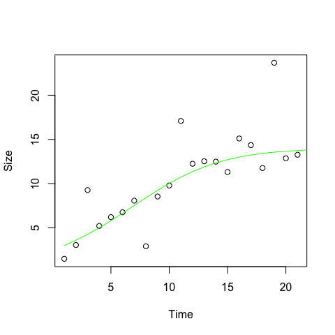
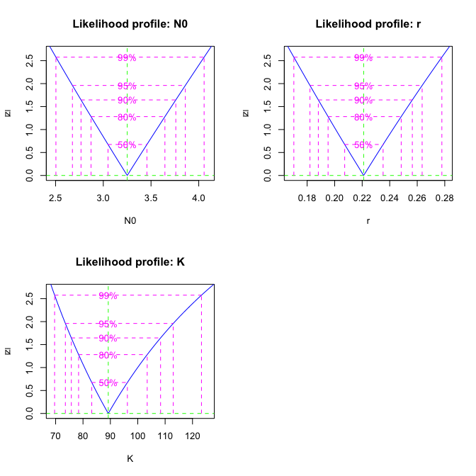

# Fitting Process Models to Data
Florian Hartig  
30 Jul 2014  


# The model 

Assume we want to fit a growth model to data. I am choosing here a logistic model for simplicty, but any other option would be fine as well. 


```r
model <- function (N0 = 3, r=0.2, K=50, timesteps = 20){
  
  popdyn <- c(N0, rep(NA, timesteps))
  for (i in 1:timesteps){
    popdyn[i+1] <- popdyn[i] * (r+1) * (1 - popdyn[i] / K) 
  }
  return(popdyn)          
}
```

# The data 

For convenience, I create our data simply from the model and add some noise 


```r
truth <- model(r = 0.25, K = 70, timesteps=100) 
data <- truth[1:21] + rnorm(21) * rexp(21)
plot(data, ylab = "Time", xlab ="Size")
```

 

For the noise, I have deliberately chosen not a normal distribution, but something that has more heavy tails


```r
hist(rnorm(1000, sd = 0.5) * rexp(1000), breaks = 50)
```

 

# Objective function

In this case, we know of course the true parameters, but in any realistic situation we wouldn't. Hence, we need to be able to compare different parameterizations to the data. 

The way this is typically done is to specify an objective function that quantifies how strongly a prediction deviates from the data. Need sumthing that calculates for us the difference between the data that we want to use to fit the model, and the model results 


```r
objective <- function(x){
  
  NO = x[1]
  r = x[2]
  K = x[3]
  
  difference = (data - model(NO, r, K, 20))^2
  return(sum(difference))
}
```


# Optimization 

Trying to optimize by hand, and then by optimization


```r
plot(data, xlim = c(0,20), ylim = c(0,20))

objective(c(5,0.4,40))
```

```
## [1] 169.3504
```

```r
lines(model(5,0.4,40), col = 1)

objective(c(5,0.4,50))
```

```
## [1] 231.8646
```

```r
lines(model(5,0.4,50), col = 2)

objective(c(4,0.4,50))
```

```
## [1] 174.7265
```

```r
lines(model(4,0.4,50), col = 3)

objective(c(4,0.4,55))
```

```
## [1] 268.4593
```

```r
lines(model(4,0.4,55), col = 4)

objective(c(4,0.4,60))
```

```
## [1] 410.6851
```

```r
lines(model(4,0.4,60), col = 5)

legend("bottomright", c("5,0.4,40", "5,0.4,50", "4,0.4,50", "4,0.4,55", "4,0.4,60"), lwd = c(1,1,1,1,1), col = 1:5 )
```

 


```r
optimfit <- optim(c(1,1.3,40), objective, method = "Nelder-Mead")

optimfit
```

```
## $par
## [1]  3.1477579  0.2324354 79.9218235
## 
## $value
## [1] 49.08554
## 
## $counts
## function gradient 
##      218       NA 
## 
## $convergence
## [1] 0
## 
## $message
## NULL
```

```r
# plotting the results

plot(data, xlim = c(0,20), ylim = c(0,20))

lines(model(optimfit$par[1], optimfit$par[2], optimfit$par[3], 40), col = "red", lwd = 2)

lines(truth[1:21], col = "green")
```

 

Look at the help in optim and change the optimization algorithm. Do the results stay the same?


```r
plot(data, xlim = c(0,20), ylim = c(0,20))

optimfit <- optim(c(1,1.3,40), objective, method = "Nelder-Mead")
lines(model(optimfit$par[1], optimfit$par[2], optimfit$par[3], 40), col = "red", lwd = 2)

optimfit <- optim(c(1,1.3,40), objective, method = "SANN")
lines(model(optimfit$par[1], optimfit$par[2], optimfit$par[3], 40), col = "red", lwd = 2)

optimfit <- optim(c(1,1.3,40), objective, method = "BFGS")
lines(model(optimfit$par[1], optimfit$par[2], optimfit$par[3], 40), col = "red", lwd = 2)

lines(truth[1:21], col = "green")
```

 


# Uncertainty around the optimum 

We can get a basic estimate of the uncertainty around the optimum by looking at the hessian, which is calculated by the optim function 


```r
optimfit <- optim(c(1,1.3,40), objective, hessian = T)
optimfit$hessian
```

```
##             [,1]       [,2]        [,3]
## [1,]   54.612414  1611.1488   2.6406695
## [2,] 1611.148764 96234.7360 203.5707491
## [3,]    2.640669   203.5707   0.4651391
```
Larger values indicate stronger uncertainty / correlation. If we want to plot the goodness-of-fit across parameters, we have two three options 

1. Change a parameter while the other parameters remain on the value given by the global optimum 
2. Change a parameter while the other parameters are adjusted 
3. Change a parameter while the other parameters take any other values, proportional to their goodness of fit

I don't think these options have a general name. In a statistical context where you optimize the likelihood, 1. is callded marginal likelihood, 2. is called profile likelihood, and 3 is called the marginal distribution (see later). 

Option 1 is conveniently done by the bblme package.


```r
library(bbmle)
```

```
## Loading required package: stats4
```

```r
objective2 <- function(N0, r, K) objective(c(N0,r,K))
fit <- mle2(objective2,list(N0=1,r=1.3,K=40))
plot(profile(fit))
```

 

```r
vcov(fit)
```

```
##             N0             r          K
## N0  0.09437883 -0.0060190502  2.0946409
## r  -0.00601905  0.0005238617 -0.1947522
## K   2.09464090 -0.1947521568 75.3584892
```

```r
cov2cor(vcov(fit))
```

```
##            N0          r          K
## N0  1.0000000 -0.8560169  0.7854277
## r  -0.8560169  1.0000000 -0.9801846
## K   0.7854277 -0.9801846  1.0000000
```

Note that the percentages don't have a meaning only if the objective function is the lieklihood. 

For option 3, see MCMC sampling below. I leave out option 2. 


# More powerful optimization algorithms in R

* optimx: A Replacement and Extension of the optim() Function http://cran.r-project.org/web/packages/optimx/index.html

* DEoptim: Global Optimization by Differential Evolution http://cran.r-project.org/web/packages/DEoptim/index.html

* CRAN Task view optimization with a lot more packages http://cran.r-project.org/web/views/Optimization.html 


# Global view on the shape of the objective function via MCMC

A disadvantage of optimization is that we don't get a global view of the objective function that we optimize, 


```r
library(coda)
```

```
## Warning: package 'coda' was built under R version 3.1.3
```

```r
proposalfunction <- function(param){
  return(rnorm(3,mean = param, sd= c(1,0.2,3)))
}

run_metropolis_MCMC <- function(startvalue, iterations){
  chain = array(dim = c(iterations+1,3))
  chain[1,] = startvalue
  for (i in 1:iterations){
    proposal = proposalfunction(chain[i,])
    
    probab = exp(-objective(proposal) + objective(chain[i,]))
    
    if (runif(1) < probab){
      chain[i+1,] = proposal
    }else{
      chain[i+1,] = chain[i,]
    }
  }
  return(mcmc(chain))
}
```


Let's run the algorithm 


```r
startvalue = c(4,1,20)
chain = run_metropolis_MCMC(startvalue, 100000)
```

Plotting the development in the chain an the marginal parameter distributions


```r
plot(chain)
```

 


To see correlations between parameters, we have to do a bit more. I'm loading a function from me to have a better plotting option. You need the 


```r
library(devtools)
source_url('https://raw.githubusercontent.com/florianhartig/LearningBayes/master/CommentedCode/02-Samplers/Analysis/MCMC_PlottingOptions.r')
```

```
## SHA-1 hash of file is b821f661afc096c03f373cfa94ff1642e384e961
## Loading required package: grid
## Loading required package: lattice
```


```r
#For plotting run 
burnIn = 10000
betterPairs(chain[-(1:burnIn),])
```

 


# Forwarding of the parametric uncertainty to our predictions 


```r
plot(data, xlim = c(0,40), ylim = c(0,20))

for (i in 1:1000){
  
  pars = chain[10000+50*i,]
  
  lines(model(pars[1], pars[2], pars[3], 40), col="#44444404", lwd = 10)
  
}

lines(model(optimfit$par[1], optimfit$par[2], optimfit$par[3], 40), col = "red", lwd = 1)
points(data, col = "red")
lines(truth, col = "green")
```

 
