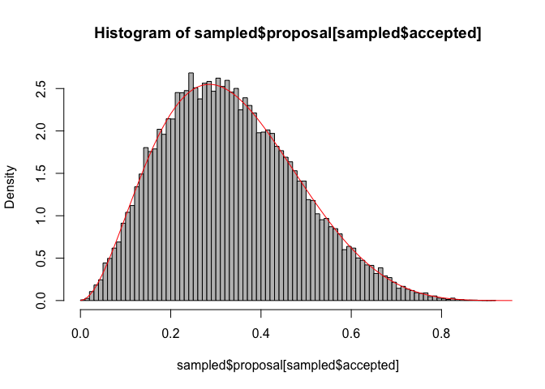

# Rejection Sampling
FlorianHartig  

### Overview

Rejection sampling is the most basic Monte Carlo sampler around. In terms of computing time it is typically less efficient than MCMCs and SMCs, but it does have some advantages that make it interesting. For example, it is trivially parallelizable. Also, rejection sampling sometimes comes in handy when you want to merge an existing sample (e.g. from an MCMC) with another distribution. 


### How it works

The idea of rejection sampling is that you create a sample from a distribution by drawing random values, and accept them proportional to their value of the distribution. 

In a Bayesian setting, this typically means that you create draws from the posterior by drawing randomly from the prior, and then accepting proportional to the likelihood. You could of course also draw randomly from the whole space, and accept from the posterior, but this would likely be less efficient. 

### An example in R

Assume we want to draw from a beta distribution with shape parameters 6,3, which looks like this


```r
curve(dbeta(x, 3,6),0,1)
```

 


To do this, we first create a data.frame with 100000 random values between 0 and 1, and calculate their beta density values 


```r
sampled <- data.frame(proposal = runif(100000,0,1))
sampled$targetDensity <- dbeta(sampled$proposal, 3,6)
```

Now, accept proportional to the targetDensity. It's easiest if we calculate the highest density value, and then accept the others in relation to that


```r
maxDens = max(sampled$targetDensity, na.rm = T)
sampled$accepted = ifelse(runif(100000,0,1) < sampled$targetDensity / maxDens, TRUE, FALSE)
```


Plot the result


```r
hist(sampled$proposal[sampled$accepted], freq = F, col = "grey", breaks = 100)
curve(dbeta(x, 3,6),0,1, add =T, col = "red")
```

 


### When would you use this sampler type

* If you have many cores available and prefer an easy parallel implementation over computation efficiency
* When working with ABC, rejection has some interesting advantages additional to the parallelization option. See section ABC for explanation of the ABC-rejection algorithm
* If you have an existing posterior sample, and you want to apply another function on 


### References for further reading 

* [Wikipedia](http://en.wikipedia.org/wiki/Rejection_sampling)
* Bolker, B. M. (2008) Ecological models and data in R. Princeton University Press.


