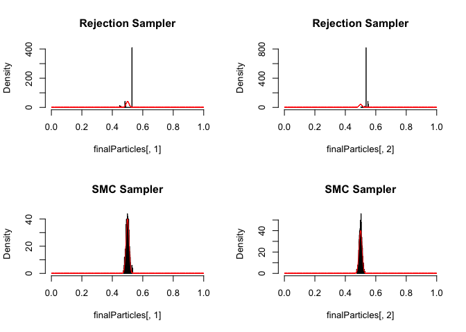

# SMC Sampling
FlorianHartig  


### Overview

SMC sampling is an extension of rejection sampling (see script about rejection sampling) that deals with a particular problem of rejection samplign, which is that a simple rejection sampler discards a large number of model evaluations when the area of non-vanising posterior density is very small compared to the prior volume

### How it works

Similar to rejection sampling, we start with an initial sample of parameters, calculate the likelihood, and then remove parameters according to their likelihood / posterior.

### An example in R

Assume we want to sample from a narrow, 2-dim normal distribution with mean 0.5,0.5


```r
likelihood <- function(x) sum(dnorm(x,0.5, 0.01, log = T))
```

Start with 


```r
initialParticles <- matrix(runif(1000,0,1), ncol = 2)
```

Now, accept proportional to the targetDensity. It's easiest if we calculate the highest density value, and then accept the others in relation to that


```r
smc_sampler <- function(likelihood, initialParticles, iterations, resampling = T){
 
  particles <- initialParticles
 
  numPar <- ncol(initialParticles)
 
  for (i in 1:iterations){
    likelihoodValues <- apply(particles, 1, likelihood)
    relativeL = exp(likelihoodValues)^(1/iterations)
    sel = sample.int(n=length(likelihoodValues), size = length(likelihoodValues), replace = T, prob = relativeL)
    particles = particles[sel,]
   
    # Resampling missing
   
    # PRIOR IS MISSING!!!!!
   
    if (resampling == T){
       
      proposal <- function(x) rnorm(length(x), mean = x, sd = 0.005)
   
      particlesProposals = t(apply(particles, 1, proposal))
   
      particlesProposalsLikelihood <- apply(particlesProposals, 1, likelihood)
 
      jumpProb <- exp(particlesProposalsLikelihood - likelihoodValues[sel])
      accepted <- jumpProb > runif(length(particlesProposalsLikelihood), 0 ,1)
     
      particles[accepted, ] = particlesProposals[accepted, ]
    }
   
  }
  return(particles )
}
```

Plot the result


```r
par(mfrow = c(2,2))

finalParticles <- smc_sampler(likelihood, initialParticles, 1, resampling = F)
hist(finalParticles[,1], freq = F, col = "grey", breaks = 50, xlim = c(0,1), main = "Rejection Sampler")
curve(dnorm(x,0.5, 0.01),0,1, n = 5000, add =T, col = "red")
hist(finalParticles[,2], freq = F, col = "grey", breaks = 50, xlim = c(0,1), main = "Rejection Sampler")
curve(dnorm(x,0.5, 0.01),0,1, n = 5000, add =T, col = "red")


finalParticles <- smc_sampler(likelihood, initialParticles, 50)
hist(finalParticles[,1], freq = F, col = "grey", breaks = 50, xlim = c(0,1), main = "SMC Sampler")
curve(dnorm(x,0.5, 0.01),0,1, n = 5000, add =T, col = "red")
hist(finalParticles[,2], freq = F, col = "grey", breaks = 50, xlim = c(0,1), main = "SMC Sampler")
curve(dnorm(x,0.5, 0.01),0,1, n = 5000, add =T, col = "red")
```

 

