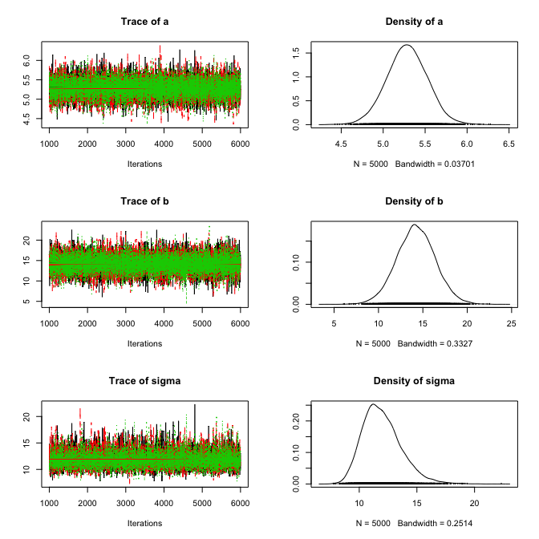

# Linear regression with Jags
Florian Hartig  
30 Jul 2014  

Based on an example provided by Jörn Pagel. 


## Creation of test data


```r
a <- 5
b <- 10
sigma <- 10

x <- -15:15
y <- a * x + b + rnorm(31,0,sd = sigma)
plot(x,y)
```

 

## Non-Bayesian analysis of this model


```r
fit <- lm(y ~ x)
summary(fit)
```

```
## 
## Call:
## lm(formula = y ~ x)
## 
## Residuals:
##      Min       1Q   Median       3Q      Max 
## -14.0694  -5.6706  -0.3227   5.1910  21.6529 
## 
## Coefficients:
##             Estimate Std. Error t value Pr(>|t|)    
## (Intercept)  13.5510     1.5429   8.783 1.15e-09 ***
## x             5.0835     0.1725  29.469  < 2e-16 ***
## ---
## Signif. codes:  0 '***' 0.001 '**' 0.01 '*' 0.05 '.' 0.1 ' ' 1
## 
## Residual standard error: 8.591 on 29 degrees of freedom
## Multiple R-squared:  0.9677,	Adjusted R-squared:  0.9666 
## F-statistic: 868.4 on 1 and 29 DF,  p-value: < 2.2e-16
```

```r
plot(allEffects(fit, partial.residuals = T))
```

 


## Bayesian analysis of this model (in Jags)


```r
  # 1) Model definition exactly how we created our data 
  modelCode = textConnection("
    model{
      # Likelihood
      for(i in 1:i.max){
      y[i] ~ dnorm(mu[i],tau)
      mu[i] <- a*x[i] + b
      }
      # Prior distributions
      a ~ dnorm(0,0.001)
      b ~ dnorm(0,0.001)
      tau <- 1/(sigma*sigma)
      sigma ~ dunif(0,100)
    }
  ")
  
  # 2) Set up a list that contains all the necessary data (here, including parameters of the prior distribution)
  Data = list(y = y, x = x, i.max = length(y))

  # 3) Specify a function to generate inital values for the parameters
  inits.fn <- function() list(a = rnorm(1), b = rnorm(1), sigma = runif(1,1,100))
```

Running the model


```r
  # Compile the model and run the MCMC for an adaptation (burn-in) phase
  jagsModel <- jags.model(file= modelCode, data=Data, init = inits.fn, n.chains = 3, n.adapt= 1000)
```

```
## Compiling model graph
##    Resolving undeclared variables
##    Allocating nodes
##    Graph Size: 134
## 
## Initializing model
```

```r
  # Specify parameters for which posterior samples are saved
  para.names <- c("a","b","sigma")

  # Continue the MCMC runs with sampling
  Samples <- coda.samples(jagsModel, variable.names = para.names, n.iter = 5000)
  
  # Plot the mcmc chain and the posterior sample for p
  plot(Samples)
```

 

convergence check


```r
gelman.diag(Samples)
```

```
## Potential scale reduction factors:
## 
##       Point est. Upper C.I.
## a              1          1
## b              1          1
## sigma          1          1
## 
## Multivariate psrf
## 
## 1
```


```r
summary(Samples)
```

```
## 
## Iterations = 1001:6000
## Thinning interval = 1 
## Number of chains = 3 
## Sample size per chain = 5000 
## 
## 1. Empirical mean and standard deviation for each variable,
##    plus standard error of the mean:
## 
##         Mean     SD Naive SE Time-series SE
## a      5.083 0.1806 0.001475        0.00145
## b     13.522 1.6362 0.013359        0.01326
## sigma  8.974 1.2650 0.010328        0.01503
## 
## 2. Quantiles for each variable:
## 
##         2.5%    25%    50%    75%  97.5%
## a      4.733  4.964  5.081  5.202  5.438
## b     10.310 12.436 13.521 14.609 16.751
## sigma  6.908  8.081  8.843  9.707 11.804
```

predictions (not very elegant)


```r
plot(x,y)
sampleMatrix <- as.matrix(Samples)
selection <- sample(dim(sampleMatrix)[1], 1000)
for (i in selection) abline(sampleMatrix[i,1], sampleMatrix[i,1], col = "#11111105")
```

 


