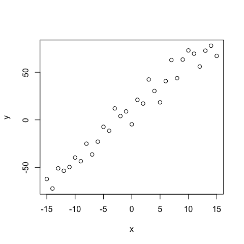
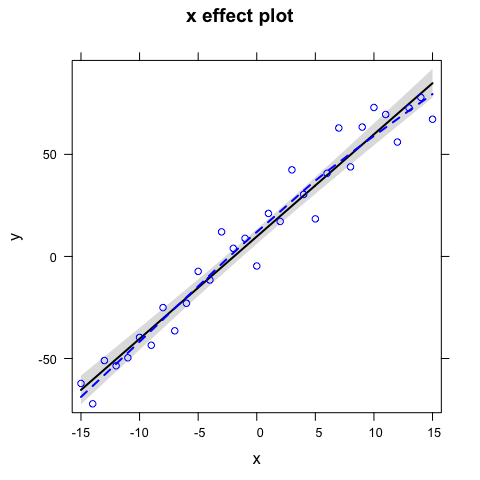
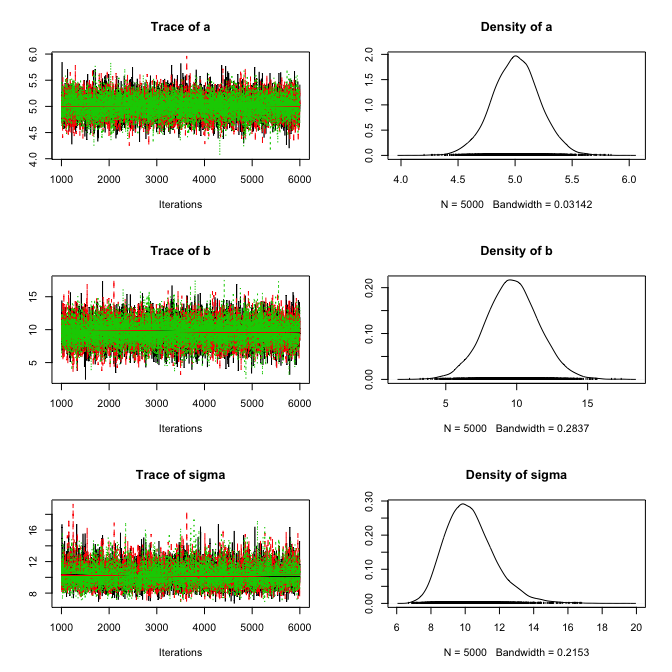
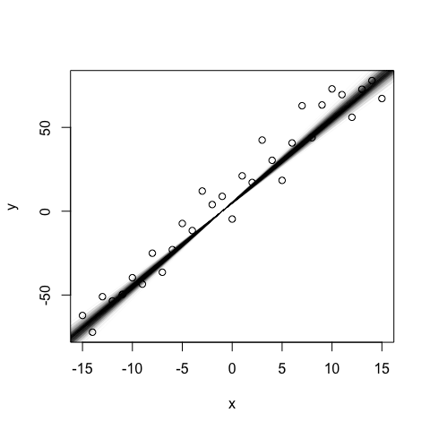
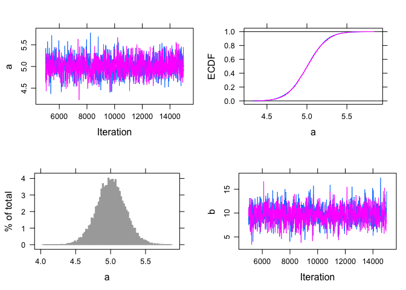
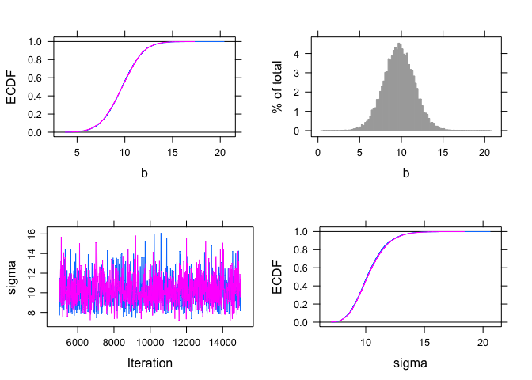
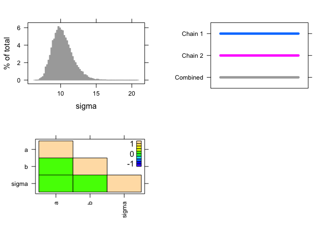
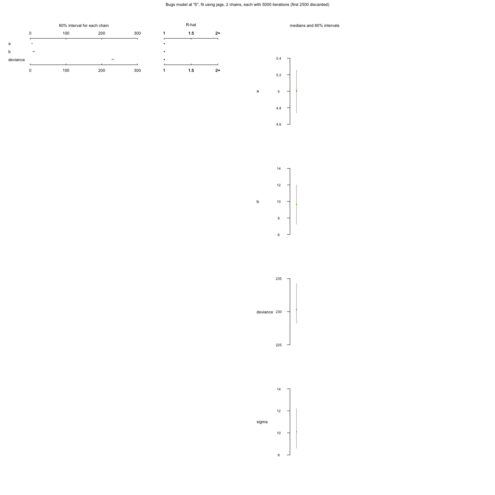

# Linear regression with Jags
Florian Hartig  
30 Jul 2014  


## Creation of test data


```r
a <- 5
b <- 10
sigma <- 10

x <- -15:15
y <- a * x + b + rnorm(31,0,sd = sigma)
plot(x,y)
```



## Non-Bayesian analysis of this model


```r
fit <- lm(y ~ x)
summary(fit)
```

```
## 
## Call:
## lm(formula = y ~ x)
## 
## Residuals:
##      Min       1Q   Median       3Q      Max 
## -17.6462  -5.1083   0.5958   4.9882  18.1263 
## 
## Coefficients:
##             Estimate Std. Error t value Pr(>|t|)    
## (Intercept)   9.7349     1.7653   5.514 6.08e-06 ***
## x             5.0086     0.1974  25.377  < 2e-16 ***
## ---
## Signif. codes:  0 '***' 0.001 '**' 0.01 '*' 0.05 '.' 0.1 ' ' 1
## 
## Residual standard error: 9.829 on 29 degrees of freedom
## Multiple R-squared:  0.9569,	Adjusted R-squared:  0.9554 
## F-statistic:   644 on 1 and 29 DF,  p-value: < 2.2e-16
```

```r
plot(allEffects(fit, partial.residuals = T))
```




## Bayesian analysis of this model (in Jags)


```r
  # 1) Model definition exactly how we created our data 
  modelCode = "
    model{
      # Likelihood
      for(i in 1:i.max){
      y[i] ~ dnorm(mu[i],tau)
      mu[i] <- a*x[i] + b
      }
      # Prior distributions
      a ~ dnorm(0,0.001)
      b ~ dnorm(0,0.001)
      tau <- 1/(sigma*sigma)
      sigma ~ dunif(0,100)
    }
  "
  
  # 2) Set up a list that contains all the necessary data (here, including parameters of the prior distribution)
  Data = list(y = y, x = x, i.max = length(y))

  # 3) Specify a function to generate inital values for the parameters
  inits.fn <- function() list(a = rnorm(1), b = rnorm(1), sigma = runif(1,1,100))
```


Running the model with rjags


```r
  # Compile the model and run the MCMC for an adaptation (burn-in) phase
  jagsModel <- jags.model(file= textConnection(modelCode), data=Data, init = inits.fn, n.chains = 3, n.adapt= 1000)
```

```
## Compiling model graph
##    Resolving undeclared variables
##    Allocating nodes
##    Graph Size: 134
## 
## Initializing model
```

```r
  # Specify parameters for which posterior samples are saved
  para.names <- c("a","b","sigma")

  # Continue the MCMC runs with sampling
  Samples <- coda.samples(jagsModel, variable.names = para.names, n.iter = 5000)
  
  # Plot the mcmc chain and the posterior sample for p
  plot(Samples)
```



convergence check


```r
gelman.diag(Samples)
```

```
## Potential scale reduction factors:
## 
##       Point est. Upper C.I.
## a              1          1
## b              1          1
## sigma          1          1
## 
## Multivariate psrf
## 
## 1
```


```r
summary(Samples)
```

```
## 
## Iterations = 1001:6000
## Thinning interval = 1 
## Number of chains = 3 
## Sample size per chain = 5000 
## 
## 1. Empirical mean and standard deviation for each variable,
##    plus standard error of the mean:
## 
##         Mean     SD Naive SE Time-series SE
## a      5.009 0.2081 0.001699       0.001699
## b      9.693 1.8667 0.015242       0.015092
## sigma 10.294 1.4490 0.011831       0.017111
## 
## 2. Quantiles for each variable:
## 
##        2.5%   25%    50%    75%  97.5%
## a     4.595 4.872  5.009  5.144  5.421
## b     6.020 8.460  9.682 10.913 13.406
## sigma 7.942 9.272 10.146 11.134 13.558
```

predictions (not very elegant)


```r
plot(x,y)
sampleMatrix <- as.matrix(Samples)
selection <- sample(dim(sampleMatrix)[1], 1000)
for (i in selection) abline(sampleMatrix[i,1], sampleMatrix[i,1], col = "#11111105")
```



# Running the model with runjags


```r
runJagsResults <- run.jags(model=modelCode, monitor=c("a","b","sigma"), data=Data, n.chains=2, method="rjags", inits=inits.fn)
```

```
## Compiling rjags model...
## Calling the simulation using the rjags method...
## Adapting the model for 1000 iterations...
## Burning in the model for 4000 iterations...
## Running the model for 10000 iterations...
## Simulation complete
## Calculating summary statistics...
## Calculating the Gelman-Rubin statistic for 3 variables....
## Finished running the simulation
```

```r
plot(runJagsResults)
```

```
## Generating plots...
```




# Running the model with R2jags


```r
R2JagsResults <- jags(data=Data, inits=inits.fn, parameters.to.save=c("a","b","sigma"), n.chains=2, n.iter=5000, model.file=textConnection(modelCode))
```

```
## module glm loaded
```

```
## Compiling model graph
##    Resolving undeclared variables
##    Allocating nodes
##    Graph Size: 134
## 
## Initializing model
```

```r
plot(R2JagsResults)
```



```r
print(R2JagsResults)
```

```
## Inference for Bugs model at "6", fit using jags,
##  2 chains, each with 5000 iterations (first 2500 discarded), n.thin = 2
##  n.sims = 2500 iterations saved
##          mu.vect sd.vect    2.5%     25%     50%     75%   97.5%  Rhat
## a          5.004   0.208   4.585   4.864   5.009   5.146   5.402 1.001
## b          9.658   1.890   5.890   8.450   9.644  10.909  13.387 1.001
## sigma     10.270   1.425   7.975   9.238  10.106  11.134  13.495 1.001
## deviance 230.889   2.631 227.852 228.964 230.276 232.101 237.531 1.001
##          n.eff
## a         2500
## b         2500
## sigma     2500
## deviance  2500
## 
## For each parameter, n.eff is a crude measure of effective sample size,
## and Rhat is the potential scale reduction factor (at convergence, Rhat=1).
## 
## DIC info (using the rule, pD = var(deviance)/2)
## pD = 3.5 and DIC = 234.4
## DIC is an estimate of expected predictive error (lower deviance is better).
```

Change to coda standard format


```r
R2JagsCoda <- as.mcmc(R2JagsResults)
plot(R2JagsCoda)
```


```r
summary(R2JagsCoda)
```

```
## 
## Iterations = 2501:4999
## Thinning interval = 2 
## Number of chains = 2 
## Sample size per chain = 1250 
## 
## 1. Empirical mean and standard deviation for each variable,
##    plus standard error of the mean:
## 
##             Mean     SD Naive SE Time-series SE
## a          5.004 0.2084 0.004168       0.004168
## b          9.658 1.8903 0.037807       0.037808
## deviance 230.889 2.6307 0.052614       0.059262
## sigma     10.270 1.4246 0.028492       0.033103
## 
## 2. Quantiles for each variable:
## 
##             2.5%     25%     50%     75%   97.5%
## a          4.585   4.864   5.009   5.146   5.402
## b          5.890   8.450   9.644  10.909  13.387
## deviance 227.852 228.964 230.276 232.101 237.531
## sigma      7.975   9.238  10.106  11.134  13.495
```


---
**Copyright, reuse and updates**: By Florian Hartig. Updates will be posted at https://github.com/florianhartig/LearningBayes. Reuse permitted under Creative Commons Attribution-NonCommercial-ShareAlike 4.0 International License
