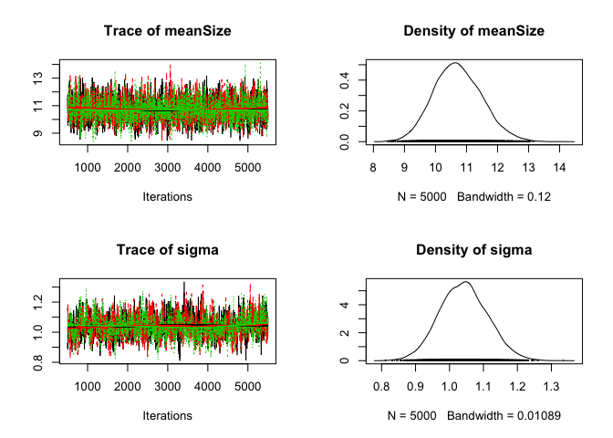

# A simple introduction to a hierarchical model
Florian Hartig  
30 Jul 2014  


```
## Loading required package: coda
## Loading required package: lattice
## Linked to JAGS 3.4.0
## Loaded modules: basemod,bugs
```


## Creation of the data

Assume the data is created from an ecological system that creates an exponential size distribution (e.g. you sample individuals from a population that can be expected to follow this distribution), but this measurments are done with a considerable lognormal observation error.

For a realistic application see http://www.plosone.org/article/info%3Adoi%2F10.1371%2Fjournal.pone.0058036


```r
meanSize <- 10
trueLogSd <- 1
sampleSize <- 500
truevalues = rexp(rate = 1/meanSize, n = sampleSize)
observations = rlnorm(n = length(truevalues), mean = log(truevalues), sd = trueLogSd)
```

Plotting true and observed data


```r
maxV <- ceiling(max(observations,truevalues))
counts <- rbind(
  obs = hist(observations, breaks = 0:maxV, plot = F)$counts,
  true = hist(truevalues, breaks = 0:maxV, plot = F)$counts
)
barplot(t(counts), beside=T)
```

 


## Fitting a non-hierarchical model leads to bias


Model specification of a non-hierarchical model in JAGS that does not account for the observation error 


```r
normalModel = textConnection('
                             model {
                             # Priors
                             meanSize ~ dunif(1,100)
                             
                             # Likelihood
                             for(i in 1:nObs){
                             true[i] ~ dexp(1/meanSize)
                             }
                             }
                             ')

# Bundle data
positiveObservations <- observations[observations>0]
data = list(true = positiveObservations, nObs=length(positiveObservations))

# Parameters to be monitored (= to estimate)
params = c("meanSize")

jagsModel = jags.model( file= normalModel , data=data, n.chains = 3, n.adapt= 500)
```

```
## Compiling model graph
##    Resolving undeclared variables
##    Allocating nodes
##    Graph Size: 505
## 
## Initializing model
```

```r
results = coda.samples( jagsModel , variable.names=params,n.iter=5000)
plot(results)
```

 

The main thing to note about this is that parameter estimates are heavily biased. 

Note: textConnection avoids having to write the string to file (default option). If you need help on how to interpret these plots, see the material about interpreting MCMC output. 


## Fitting a hierarchical model removes the bias

Model specification if hierarchical model that accounts for the observation error in Jags


```r
hierarchicalModel = textConnection('
                                   model {
                                   # Priors
                                   meanSize ~ dunif(1,100)
                                   sigma ~ dunif(0,20) # Precision 1/variance JAGS and BUGS use prec instead of sd
                                   precision <- pow(sigma, -2)
                                   
                                   # Likelihood
                                   for(i in 1:nObs){
                                   true[i] ~ dexp(1/meanSize)
                                   observed[i] ~ dlnorm(log(true[i]), precision)
                                   }
                                   }
                                   ')
# Bundle data
data = list(observed = observations, nObs=length(observations))
# Parameters to be monitored (= to estimate)
params = c("meanSize", "sigma")

jagsModel = jags.model( file= hierarchicalModel , data=data, n.chains = 3, n.adapt= 500)
```

```
## Compiling model graph
##    Resolving undeclared variables
##    Allocating nodes
##    Graph Size: 1511
## 
## Initializing model
```

```r
#update(jagsModel, 2500) # updating without sampling
results = coda.samples( jagsModel , variable.names=params,n.iter=5000)
plot(results)
```

 

It's allways good to check the correlation structure in the posterior


```r
pairs(as.matrix(results))
```

 


