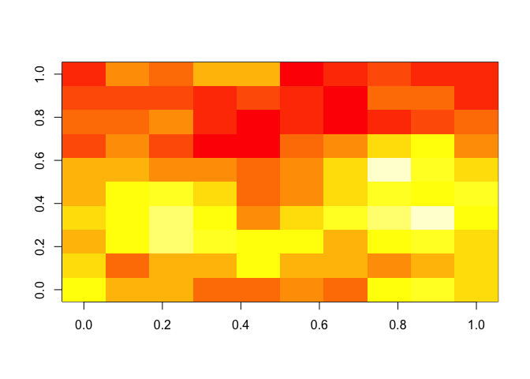
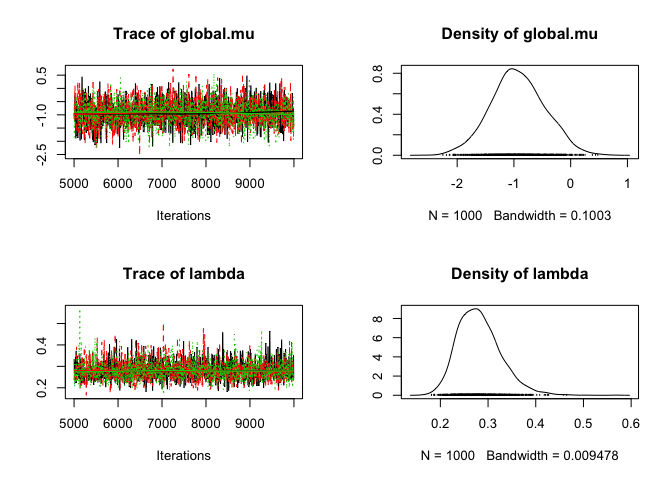

# Explaining the spatial autoregressive model with JAGS
Florian Hartig  
30 Jul 2014  

This is based on code posted originally by Petr Keil http://www.petrkeil.com/?p=1910, to illustrate some comments I made in response to this blog post 


## Creating the data 

This helper function that makes distance matrix for a side*side 2D array  


```r
dist.matrix <- function(side)
{
  row.coords <- rep(1:side, times=side)
  col.coords <- rep(1:side, each=side)
  row.col <- data.frame(row.coords, col.coords)
  D <- dist(row.col, method="euclidean", diag=TRUE, upper=TRUE)
  D <- as.matrix(D)
  return(D)
}
```

Here is the function that simulates the autocorrelated 2D array with a given side, and with exponential decay given by lambda (the mean mu is constant over the array, it equals to global.mu)


```r
cor.surface <- function(side, global.mu, lambda)
{
  D <- dist.matrix(side)
  # scaling the distance matrix by the exponential decay
  SIGMA <- exp(-lambda*D)
  mu <- rep(global.mu, times=side*side)
  # sampling from the multivariate normal distribution
  M <- matrix(nrow=side, ncol=side)
  M[] <- rmvnorm(1, mu, SIGMA)
  return(M)
}
```

OK, finally simulating the data 


```r
# parameters (the truth) that I will want to recover by JAGS
side = 10
global.mu = 0
lambda = 0.3  # let's try something new

# simulating the main raster that I will analyze as data
M <- cor.surface(side = side, lambda = lambda, global.mu = global.mu)
image(M)
```

 

```r
mean(M)
```

```
## [1] -0.7532165
```

```r
# simulating the inherent uncertainty of the mean of M: 
#test = replicate(1000, mean(cor.surface(side = side, lambda = lambda, global.mu = global.mu)))
#hist(test, breaks = 40)
```


## Fitting the model in JAGS

preparing the data


```r
y <- as.vector(as.matrix(M))
my.data <- list(N = side * side, D = dist.matrix(side), y = y)
```

defining the model


```r
modelCode = textConnection("
    model
{
    # priors
    lambda ~ dgamma(1, 0.1) 
    global.mu ~ dnorm(0, 0.01)
    for(i in 1:N)
{
    # vector of mvnorm means mu
    mu[i] <- global.mu
}
    
    # derived quantities
    for(i in 1:N)
{
    for(j in 1:N)
{
    # turning the distance matrix to covariance matrix
    D.covar[i,j] <- exp(-lambda*D[i,j])
}
}
    # turning covariances into precisions (that's how I understand it)
    D.tau[1:N,1:N] <- inverse(D.covar[1:N,1:N])
    
    # likelihood
    y[1:N] ~ dmnorm(mu[], D.tau[,])
}
")
```

Running the model


```r
fit <-  jags(data=my.data, 
             parameters.to.save=c("lambda", "global.mu"),
             model.file=modelCode,
             n.iter=10000,
             n.chains=3,
             n.burnin=5000,
             n.thin=5,
             DIC=FALSE)
```

```
## module glm loaded
## module dic loaded
```

```
## Compiling model graph
##    Resolving undeclared variables
##    Allocating nodes
##    Graph Size: 10114
## 
## Initializing model
```

```r
plot(as.mcmc(fit))
```

 

```r
pairs(as.matrix(as.mcmc(fit)))
```

 


